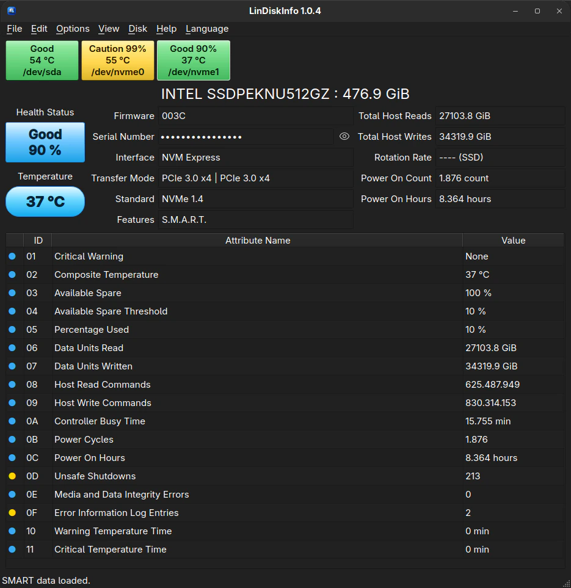
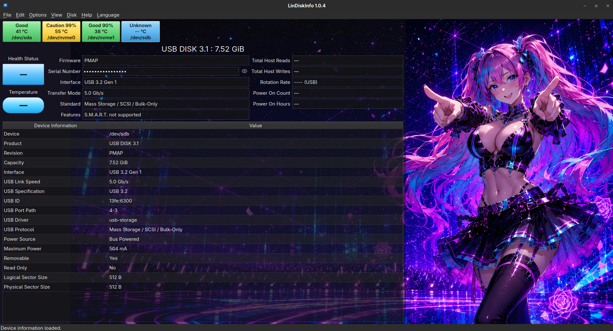
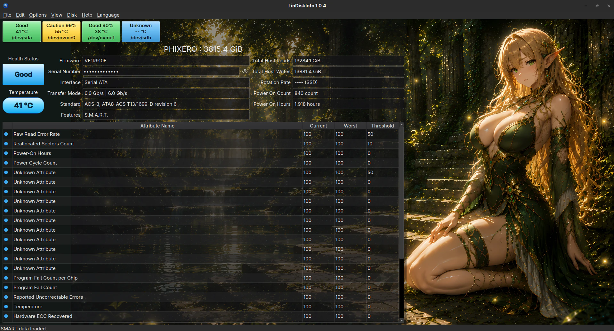
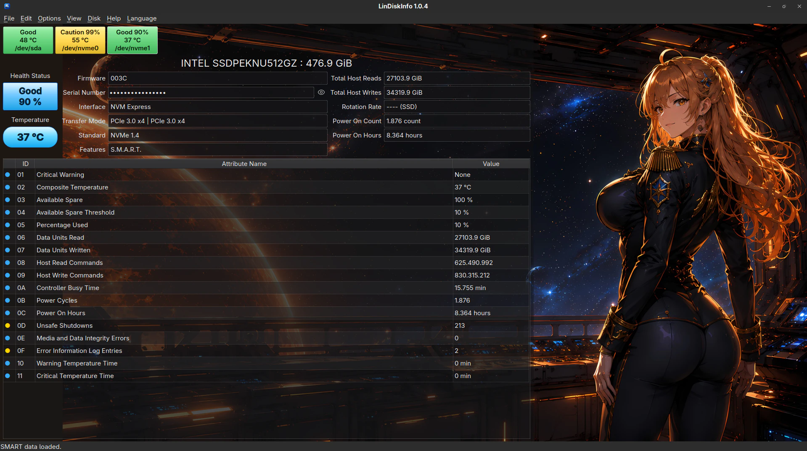

# LinDiskInfo

LinDiskInfo is a Qt-based S.M.A.R.T. and NVMe health monitor for Linux, featuring a clean interface inspired by CrystalDiskInfo.

LinDiskInfo is an independent Linux project. It does not use CrystalDiskInfo source code, libraries, binaries or assets.

  

## Features

- ATA and SATA S.M.A.R.T. information
- NVMe health and lifetime statistics
- Conservative SATA SSD remaining-life reporting when smartctl exposes a recognized lifetime metric
- Temperature monitoring and configurable warning thresholds
- S.M.A.R.T. attribute tables and multiple raw-value formats
- NVMe PCIe transfer-mode information
- USB and external-storage detection
- MegaRAID physical-drive support where exposed by smartctl
- AAM and APM controls for supported ATA drives
- S.M.A.R.T. self-tests and device logs
- Historical health and temperature graphs
- System tray integration
- Automatic device detection and refresh
- English and German interface
- System and dark themes plus ten optional integrated character themes

## Themes

LinDiskInfo includes the system and dark themes as well as ten optional integrated character themes.

  
  
  

## Runtime requirements

- Linux
- Qt 6 Widgets
- smartmontools / smartctl
- polkit / pkexec

## Build requirements

- CMake 3.21 or newer
- C++20 compiler
- Qt 6 development files
- Ninja or another CMake-supported build system

## Build

    cmake -S . -B build -G Ninja -DCMAKE_BUILD_TYPE=Release
    cmake --build build

## Install

    cmake --install build --prefix /usr

Linux packages should normally stage installation with DESTDIR instead of writing directly into the live filesystem during package creation.

## Privileged SMART access

The LinDiskInfo graphical interface runs as the normal unprivileged user.

When privileged S.M.A.R.T. access is required, LinDiskInfo starts a dedicated helper through pkexec. The helper uses a restricted JSON protocol and invokes /usr/bin/smartctl only with validated devices, device types and supported operations.

The complete graphical application is never started as root.

## Privacy

LinDiskInfo can optionally maintain local device-health history in the user's application-data directory.

History device keys are stored as SHA-256 based identifiers instead of plaintext drive serial numbers.

Legacy plaintext history keys are migrated automatically when the history file is loaded.

## License

LinDiskInfo is free software licensed under GPL-3.0-or-later.

Copyright © 2026 PacmanicS

Project website: https://pacmanics.com

See LICENSE for the full GNU General Public License version 3 text.

## Third-party software

LinDiskInfo uses Qt 6 and communicates with smartmontools / smartctl.

smartmontools / smartctl is distributed under GPL-2.0-or-later.

Qt 6 is distributed under the applicable Qt licensing terms.

## Design inspiration

The LinDiskInfo interface is inspired by CrystalDiskInfo.

CrystalDiskInfo is not a bundled component or dependency of LinDiskInfo.
